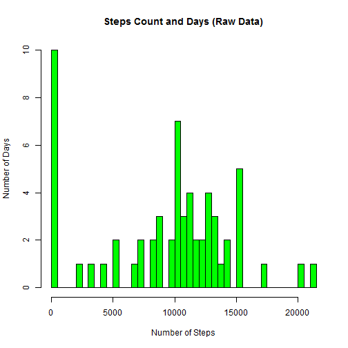
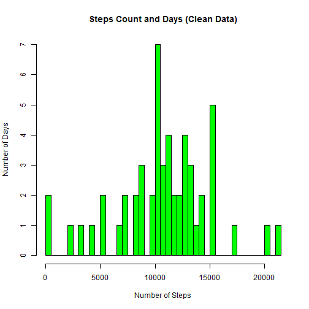
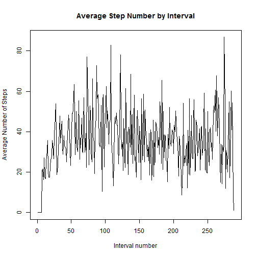
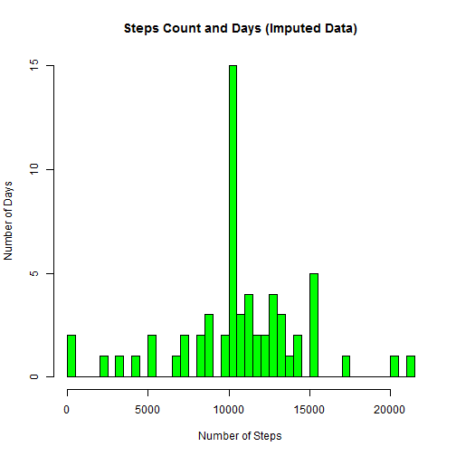
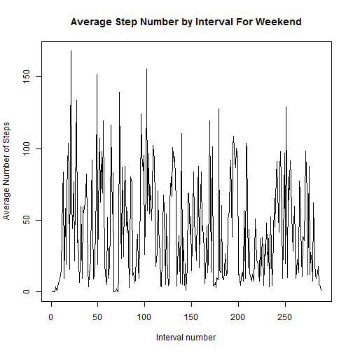
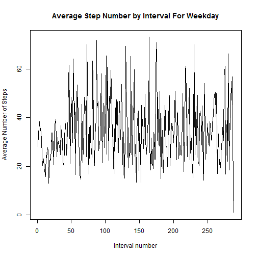

Reproducible Research: Project 1
========================================================

In this project students were asked to download a data set comprised of readings taken from personal activity monitoring devices.  Once downloaded, students were asked to perform a number of data cleaning and data munging activities and report results.  

## Loading and preprocessing the data

Data for the project was obtained via download as follows:


```r
fileUrl <- "http://d396qusza40orc.cloudfront.net/repdata%2Fdata%2Factivity.zip"
download.file(fileUrl, destfile = "activity.zip")

activityDatedownloaded <-date()
write(activityDatedownloaded, file ="activityDatedownloaded")

unzip("activity.zip")
```

Once downloaded, the file was read into memory as follows:


```r
data<- read.csv("activity.csv")
```

To begin the analysis, determine the structure of the downloaded data.  To accomplish this use the "str" command:


```r
str(data)
```

```
## 'data.frame':	17568 obs. of  3 variables:
##  $ steps   : int  NA NA NA NA NA NA NA NA NA NA ...
##  $ date    : Factor w/ 61 levels "2012-10-01","2012-10-02",..: 1 1 1 1 1 1 1 1 1 1 ...
##  $ interval: int  0 5 10 15 20 25 30 35 40 45 ...
```
There are a variety of approaches for determining the number of missing values in the data.  The following code

```r
sum(complete.cases(data))
```

```
## [1] 15264
```

```r
nrow(data)- sum(is.na(data$steps))
```

```
## [1] 15264
```
indicates that missing data occurs only in the first column of the data frame and that there are precisely 2304 missing values.  

To begin the analysis, it is useful to have a method for breaking the data up into days.  One way to do this is to construct a file which records the distinct days represented in the data frame.  This is straightforward:


```r
ddate<- sapply(data$date,as.character)

Days<- as.character()
for (j in 1:17568) {
  if (!(is.element(ddate[j],Days))) {
		Days<- c(Days, ddate[j]) 
	}
}
```
Once a list of days is constructed, it is easy to count the number of steps per day:

```r
StepsPerDay<- as.numeric()
for (j in Days ) {
  stepsdata <- subset(data, data$date==j)
	DayStep<- sum(stepsdata$steps,na.rm=TRUE)
	StepsPerDay <-c(StepsPerDay,DayStep)
}
```
As is clear from the above, we have chosen to remove the "NA" data.  This is different than setting "NA" data to "0" (in fact, the data frame contains a number of instances where "0" steps were recorded, indicating that "0" and "NA" should be treated differently). There is a problem, however: for any day for which there is no data, the step count will be "0".  This is not what we want.  To check whether this is happening we dump our results to an initial histogram: 


```r
hist(StepsPerDay, ylab = "Number of Days", xlab = "Number of Steps",
breaks= 60, col="green", main="Steps Count and Days (Raw Data)")
```

 

The histogram indicates that there are 10 days where the number of steps is small.  We take a closer look at these days, as they likely contain instances of missing values.  In fact, we can extract those days where there are missing values:

```r
NADay<- as.character()
for (j in Days ) {
  stepsdata <- subset(data, data$date==j)
	if (sum(is.na(stepsdata$steps))>0){
		NADay <-c(NADay,j)
	}
}
```
We can see how many missing values there are on days were there are missing values:

```r
NAStepsPerDay<- numeric()
for (j in NADay) {
  nastepsdata <- subset(data, data$date==j)
	NAStepsPerDay <- c(NAStepsPerDay, sum(is.na(nastepsdata$steps)))
}
NAStepsPerDay
```

```
## [1] 288 288 288 288 288 288 288 288
```
Thus, the eight days account for all missing data and on each day for which there is some missing data, there is no data for that day.  
This suggests that when computing the mean and the median, we should not use the data from the days in the file "NADay".  This restriction is accomplished via the set difference function.   


```r
GoodDays<-setdiff(Days, NADay)
GStepsPerDay<- as.numeric()
for (j in GoodDays ) {
  	stepsdata <- subset(data, data$date==j)
		DayStep<- sum(stepsdata$steps,na.rm=TRUE)
		GStepsPerDay <-c(GStepsPerDay,DayStep)
}
```
This completes data preprocessing.

## What is mean total number of steps taken per day?

We can use our previous code to produce histograms and statistics for the clean data:


```r
hist(GStepsPerDay, ylab = "Number of Days", xlab = "Number of Steps", breaks= 52, col="green", main="Steps Count and Days (Clean Data)")
```

 

```r
CleanMean<- mean(GStepsPerDay)
CleanMedian<- median(GStepsPerDay)
CleanMean
```

```
## [1] 10766
```

```r
CleanMedian
```

```
## [1] 10765
```
Summarizing: There are 61 days of data in the original data.  On eight of those days, there is no data available.  If we restrict to the remaining 53 days of data, the mean number of step per day is 10766 and the median number of steps per day is 10765.

## What is the average daily activity pattern?

To continue the analysis, extract a data frame which does not include rows with missing data:

```r
Gooddata<-data[!(data$date %in% NADay),]
```
To compute 5 minute interval statistics, note that there are 288 intervals per day.  We construct interval means as follows:

```r
IntervalMeans<-numeric()
for (j in 1:288) {
  jtotal<- 0
	for (i in 1:53) { 
		jtotal<- jtotal+ Gooddata$steps[j*i]}
	IntervalMeans<- c(IntervalMeans, as.numeric(jtotal)/53)
}
```
We can now produce the required time series:

```r
plot(1:288, IntervalMeans, type="l", xlab="Interval number",
ylab="Average Number of Steps", main="Average Step Number by Interval")
```

 

To find the interval which produces the largest number of steps, run

```r
which.max(IntervalMeans)
```

```
## [1] 274
```

## Imputing missing values

We have seen that there are precisely 2304 missing values in the data set.  To impute values for the missing data, we will adopt the following algorithm.  

For each missing piece of data, determine to which interval it belongs and use the average number of steps for that interval as an imputed value.  Because we are measuring in steps, we will round the averages to the nearest integer.  

The code is straightforward:


```r
RIntervalMeans<- round(IntervalMeans)

locator<-integer()
for (j in NADay ) {
  locator<- c(locator, which(Days ==j))
}

Idata<- data

for (j in locator){
	for (i in 1:288) {
		Idata[288*(j-1) +i,1] <-RIntervalMeans[i] 
	}
}
```

Our previous code works to count the number of steps in a day:

```r
IStepsPerDay<- as.numeric()
for (j in Days ) {
  istepsdata <- subset(Idata, Idata$date==j)
	iDayStep<- sum(istepsdata$steps,na.rm=TRUE)
	IStepsPerDay <-c(IStepsPerDay,iDayStep)
}
```

We can use the same code we have above to generate a corresponding histogram and statistics:


```r
hist(IStepsPerDay, ylab = "Number of Days", xlab = "Number of Steps",
breaks= 60, col="green", main="Steps Count and Days (Imputed Data)")
```

 

```r
mean(IStepsPerDay)
```

```
## [1] 10706
```

```r
median(IStepsPerDay)
```

```
## [1] 10395
```
As is clear from the above, the mean and the median for the clean and imputed data differ.  Note that the number of steps on each day for which we imputed a value is 

```r
sum(RIntervalMeans)
```

```
## [1] 10308
```

This number is less that the mean and the median of the clean data and thus it is not surprising that we get a lower mean and 
median for the imputed data.  We can compute the mean of the imputed data using the mean of the clean data:  

```r
((8*sum(RIntervalMeans)) + 53*CleanMean)/61
```

```
## [1] 10706
```

which checks with our previous calculation.  A similar check explains the shift in median.  


## Are there differences in activity patterns between weekdays and weekends?

To parse the data in terms of weekdays, we will use the lubridate package:


```r
library(lubridate)
```

Next, we create a logical using the functionality of lubridate:


```r
weekdaydata2<-wday(ddate)
weekend<- integer()
for (j in 1:17568) {
  if (weekdaydata2[j]==0 | weekdaydata2[j] == 6) {
		weekend<- c(weekend,1)}
	else {weekend<- c(weekend,0)
	}
}
Weekend<-as.factor(weekend)
```

We bind this to our imputed data


```r
IWdata<- cbind(Idata,Weekend)
```

To construct average activity plots for the weekend and weekday data, we extract using our new logical.


```r
IWeekenddata <- subset(IWdata, Weekend==1)
IWeekdaydata <- subset(IWdata, Weekend==0)
```

We can now use our previous code to give daily activity charts for weeknds and weekdays.

First, we compute the number of weekend days and the number of weekdays:


```r
NWeekend<- nrow(IWeekenddata)/288
NWeekday<- 61-NWeekend
```

Next, we construct the required time series:


```r
IntervalMeansWeekend<-numeric()
for (j in 1:288) {
  jtotal<- 0
  for (i in 1:NWeekend) { 
  	jtotal<- jtotal+ IWeekenddata$steps[j*i]}
	IntervalMeansWeekend<- c(IntervalMeansWeekend, as.numeric(jtotal)/NWeekend)
}

IntervalMeansWeekday<-numeric()
for (j in 1:288) {
  jtotal<- 0
  for (i in 1:NWeekday) { 
  	jtotal<- jtotal+ IWeekdaydata$steps[j*i]}
	IntervalMeansWeekday<- c(IntervalMeansWeekday, as.numeric(jtotal)/NWeekday)
}
```
and the time series:


```r
plot(1:288, IntervalMeansWeekend, type="l", xlab="Interval number",
ylab="Average Number of Steps", main="Average Step Number by Interval For Weekend")
```

 

```r
plot(1:288, IntervalMeansWeekday, type="l", xlab="Interval number",
ylab="Average Number of Steps", main="Average Step Number by Interval For Weekday")
```

 


